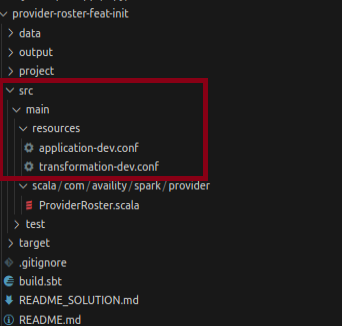
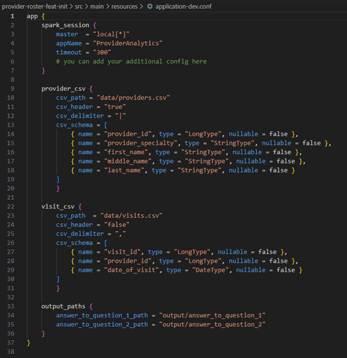
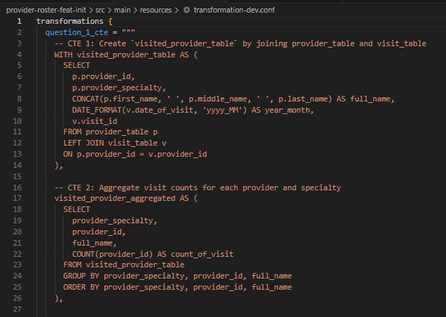
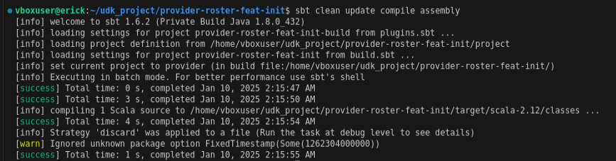
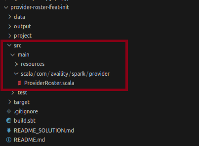
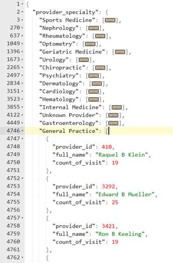
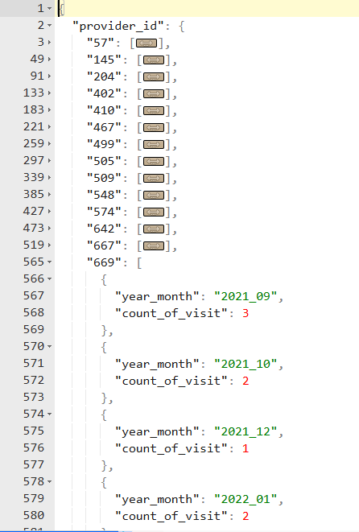
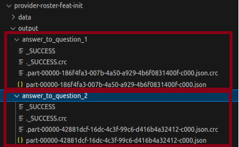
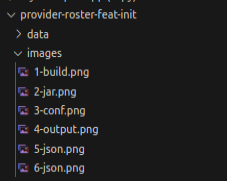

# I. DEPLOYMENT
## 1. Environment Preparation
- Created an Ubuntu 22.04 VM using VirtualBox
- Installed java, scala, spark, code
- Downloaded the zip file from https://gitlab.com/dane.allen.3/provider-roster/-/blob/feat/init/README.md?ref_type=heads
- extracted the zip file to local folder in ubuntu as "provider-roster-feat-init"

## 2. Application Preparation
- Updated provider-roster-feat-init/build.sbt
- Updated provider-roster-feat-init/src/main/scala/com/availity/spark/provider/ProviderRoster.scala
    
    - conf file location

    

    

    - provider-roster-feat-init/src/main/resources/application-dev.conf
    
    

    

    - provider-roster-feat-init/src/main/resources/transformation-dev.conf

    

    

    
## 3. Application Logics
- The application is consisted of 7 steps
- Step 1: Read application and transformation configs
- Step 2: Initialize SparkSession
- Step 3: Read input files (providers.csv and visits.csv) to DataFrames
- Step 4: Register the DataFrames as tables
- Step 5: Extract the sql transformation scripts from transformation.conf file
- Step 6: create dataframes from the query strings representing the result (solution)
- Step 7: write the dataframes as json files

## 4. Compile + Create JAR
- Open vs code in ubuntu
- Open the folder provider-roster-feat-init 
- Open the vs code integrated terminal
- Run the following from the command line "sbt clean update compile assembly"

    

    

## 5. JSON Output
- Once the uber jar is created in the target/scala-2.12/provider.jar, then run the following command line 
- "spark-submit --class com.availity.spark.provider.ProviderRoster target/scala-2.12/provider.jar"

    

- The above step will produce 2 output json folders representing the output files for the 2 questions
    - Question 1:
        Given the two data datasets, calculate the total number of visits per provider. The resulting set should contain the provider's ID, name, specialty, along with the number of visits. Output the report in json, partitioned by the provider's specialty. 
    
        

    

    - Question 2:
        Given the two datasets, calculate the total number of visits per provider per month. The resulting set should contain the provider's ID, the month, and total number of visits. Output the result set in json.

    

    - Here are the location of the files

            

# II. ASSUMPTIONS
1. Implemented 2 conf files, i.e., 
    -   src/main/resources/application-dev.conf
        - defines the application details pertaining to 
        -   a. spark_session (contains the info about the spark session)
        -   b. provider.csv (source location, schema, delimiter, etc)
        -   c. visit.csv (source location, schema, delimiter, etc)
        -   d. output_paths (contains the location of the output json files) 
    -   src/main/resources/transformation-dev.conf
        - defines the transformation logic to join the provider with the visit data
        - uses CTEs to handle the joining, aggregation and transformation logics to match the required JSON structure 

2. Added "com.typesafe" % "config" % "1.4.2" on build.sbt to simplify the parsing of conf files
3. Implemented logging, i.e. import org.slf4j.LoggerFactory
4. Imeplemented try, catch, finally
5. Method testing not implemented

# III. DATA OBSERVATION
## 1. In the provider.csv files, 
    - there are a total of 1000 rows, with 0 null values
    - unique provider_id is 992 
    - 8 provider_id have 2 provider_specialty. See below:
        - 86440
        - 86202
        - 82338
        - 99487
        - 55504
        - 56273
        - 63596
        - 25817
## 2. In the visit.csv, 
    - there are a total of 22,348 rows, with 0 null values
    - no duplicate on visit_id
    - there is provider_id but provider_specialty is not available, 
## 3. Important Notice
- NO ADJUSTMENT WAS MADE TO CORRECT "THE IMPACT OF PROVIDER_ID WITH 2 PROVIDER_SPECIALTY" SINCE THERE IS NO SPECIFIC INSTRUCTION OR DESCRIPTION ABOUT IT.
- The impact will be double counting the visits for those 8 provider_id, which can be translated as a VISIT on a provider_id will mean visiting both PROVIDER_SPECIALTY which can skew the total number of visits when re-aggregated by provider_specialty by provider_id. 

# IV. DOCUMENTATION
- See the provider-roster-feat-init/README_SOLUTION.md.
- It describes the entire solution
- See the 7 images on provider-roster-feat-init/images 

    

